# Cyber Pros AI Governance Portfolio Project: Automated Loan Underwriting System (Vivek Korikanthimath)

## Executive Summary

I served as the **AI Governance Lead** for a fictional high-risk AI governance assessment involving Meridian Financial Services, a mid-sized financial services company piloting an automated loan underwriting system.

The system uses a third-party AI model, **CrediSure Credit Decision Engine v2.3**, to evaluate small business loan applications and produce one of three outcomes:

- Auto-approve
- Auto-deny
- Route to manual review

Because approximately **94% of applications are processed automatically** and the system affects access to credit, I classified this as a **high-risk AI use case** requiring governance review before production deployment.

My final recommendation was:

> **Proceed with conditions. Meridian should not approve unrestricted production deployment until fairness testing, proxy-bias review, reason code validation, human oversight triggers, appeal procedures, vendor evidence review, monitoring thresholds, and governance committee approval are completed.**

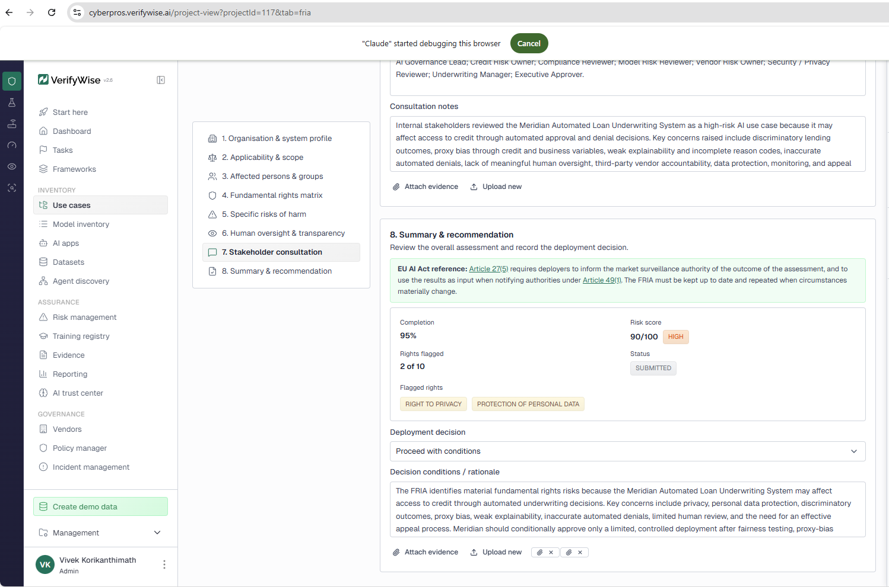

> **Caption:** This screenshot shows the EU AI Act FRIA summary for the Meridian Automated Loan Underwriting System, including stakeholder consultation status, flagged rights, risk score, and conditional approval recommendation.

## Frameworks Applied

| EU AI Act | NIST AI Risk Management Framework | ISO/IEC 42001 |
|---|---|---|
| High-risk AI classification | Governance roles and responsibilities | AI management system scope |
| Fundamental Rights Impact Assessment | System context and intended use | Organizational roles and responsibilities |
| Human oversight| Risk measurement and testing evidence | AI risk assessment |
| Logging | Risk prioritization and treatment | AI risk treatment |
| Explanation to affected persons | Human-AI oversight | Management review |
| Fundamental Rights Impact Assessment | | AI system lifecycle management |
| Appeal and contestability| | Third-party AI risk management |
| Deployment conditions | | |

This portfolio demonstrates my ability to perform practical AI governance work for a high-risk AI system.

Specifically, this project shows that I can:

- Lead an AI governance review for a high-risk AI use case
- Document an AI system profile and governance intake record
- Identify and assess AI risks related to fairness, explainability, automation, vendor risk, and human oversight
- Apply EU AI Act, NIST AI RMF, and ISO/IEC 42001 concepts in a practical way
- Review third-party AI model and vendor governance concerns
- Design human oversight, exception review, and appeal procedures
- Prepare an executive-ready production readiness recommendation
- Use AI governance tooling to organize evidence, risks, policies, and framework assessments

---

## Central Governance Question

This portfolio answers one central question:

> **Should Meridian Financial Services approve production deployment of a 94% automated AI loan underwriting system?**

My answer:

> **Not for unrestricted production deployment. The system may proceed only with conditions because the current governance evidence does not fully support safe, fair, explainable, accountable, and well-monitored deployment.**

## Portfolio Artifacts

| Artifact | Purpose | Link |
|---|---|---|
| AI System Profile and Intake Record | Documents system purpose, users, affected groups, data, vendor, and risk classification. | [View Artifact](1.%20AI%20Governance%20Intake%20Record.docx) |
| AI Risk Register and Mitigation Summary | Documents key AI risks, severity, controls, residual risk, and recommendations. | [View Artifact](3.%20AI%20Risk%20Register%20Mitigation%20Summary.docx) |
| Human Oversight and Appeal Procedure | Defines human review triggers, override authority, escalation, and applicant appeal process. | [View Artifact](4.%20Human%20Oversight%20Appeal%20Procedure.docx) |
| Third-Party Vendor and Model Review | Evaluates CrediSure AI vendor risk, model limitations, and required evidence. | [View Artifact](2.%20Vendor%20Model%20Governance%20Review.docx) |
| Production Readiness Decision Memo | Provides final executive recommendation. | [View Artifact](5.%20AI%20Governance%20Production%20Readiness%20Decision%20Memo.docx) |
| Final VerifyWise Portfolio Report | Consolidated portfolio report generated from VerifyWise. | [View Report](Vivek_Korikanthimath_AI_Governance_Portfolio_Report.pdf) |

---

## Practical AI governance Skill Proof (Screenshots)

### 1. Use Case Registration

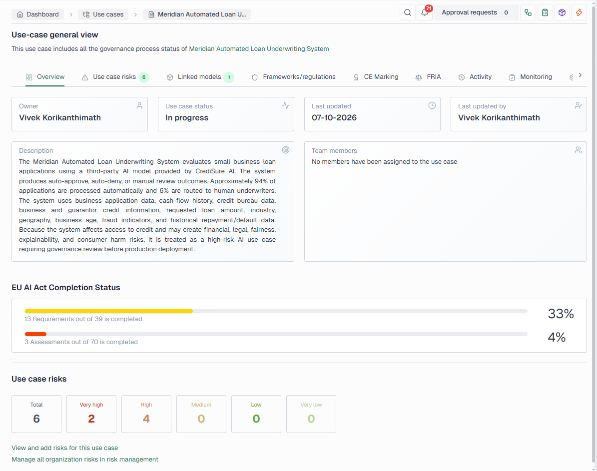

> **Caption:** This screenshot shows the Meridian Automated Loan Underwriting System registered as a high-risk AI use case in VerifyWise.

**Skill demonstrated:** AI use case intake, risk classification, and governance workflow setup.

---

### 2. Model Inventory

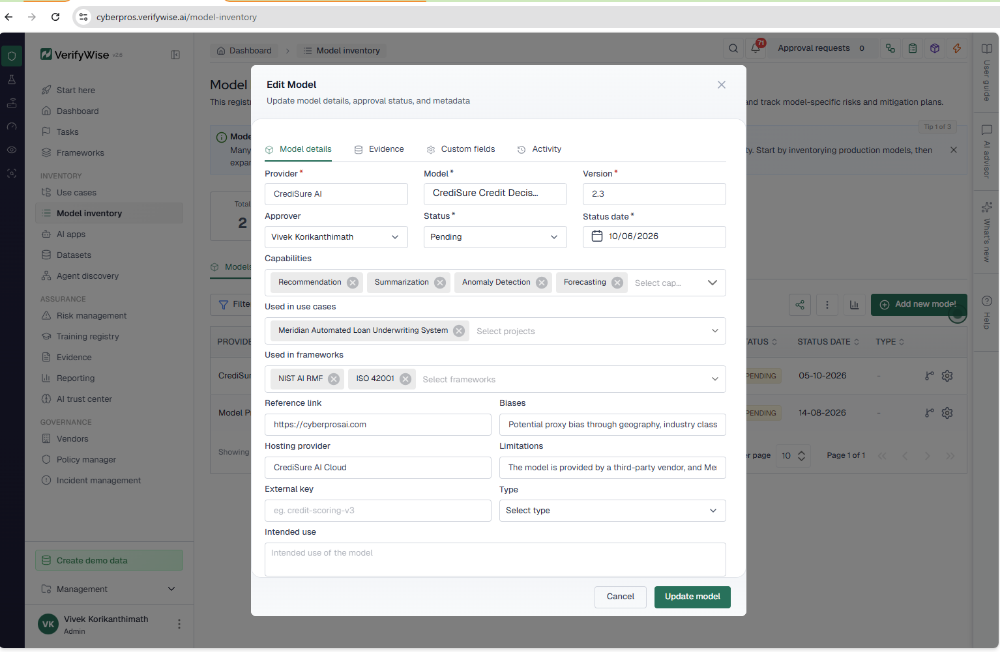

> **Caption:** This screenshot shows the CrediSure Credit Decision Engine v2.3 documented in the model inventory.

**Skill demonstrated:** Model inventory documentation, model limitation tracking, and third-party AI model governance.

---

### 3. Dataset Record

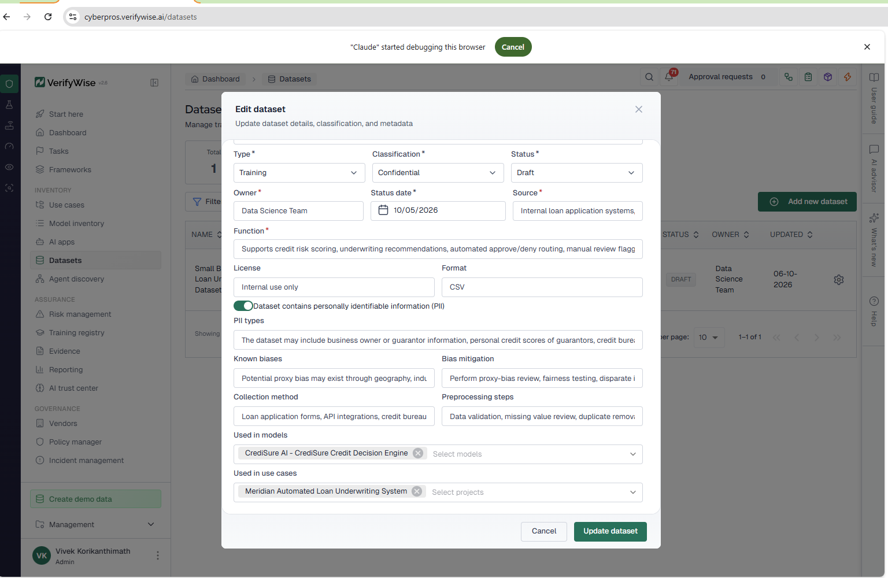

> **Caption:** This screenshot shows the Small Business Loan Underwriting Dataset documented with data purpose, source, PII status, known bias concerns, and mitigation approach.

**Skill demonstrated:** Dataset governance, PII awareness, data source documentation, and bias mitigation planning.

---

### 4. AI Risk Register

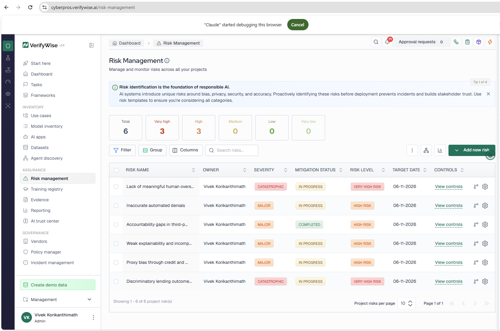

> **Caption:** This screenshot shows the six priority AI risks documented for the Meridian Automated Loan Underwriting System.

**Skill demonstrated:** AI risk identification, risk rating, mitigation planning, residual risk analysis, and approval workflow documentation.

## Key Risks Identified

| Risk | Why It Matters |
|---|---|
| Discriminatory lending outcomes | The system may unfairly approve or deny applicants based on biased data, proxy variables, or historical lending patterns. |
| Proxy bias through credit and business variables | Variables such as geography, business age, industry, credit history, thin credit files, or cash-flow volatility may create unfair outcomes. |
| Weak explainability and incomplete reason codes | Meridian may be unable to explain automated denials, support appeals, or demonstrate compliance during review. |
| Accountability gaps in third-party AI deployment | Meridian remains responsible for deployment even if the vendor controls key model details. |
| Inaccurate automated denials | Qualified applicants may be incorrectly denied credit due to model error, incomplete data, or overly strict thresholds. |
| Lack of meaningful human oversight | Routing only 6% of applications to human review may be insufficient for a high-risk credit decision system. |

---

### 5. Vendor Record

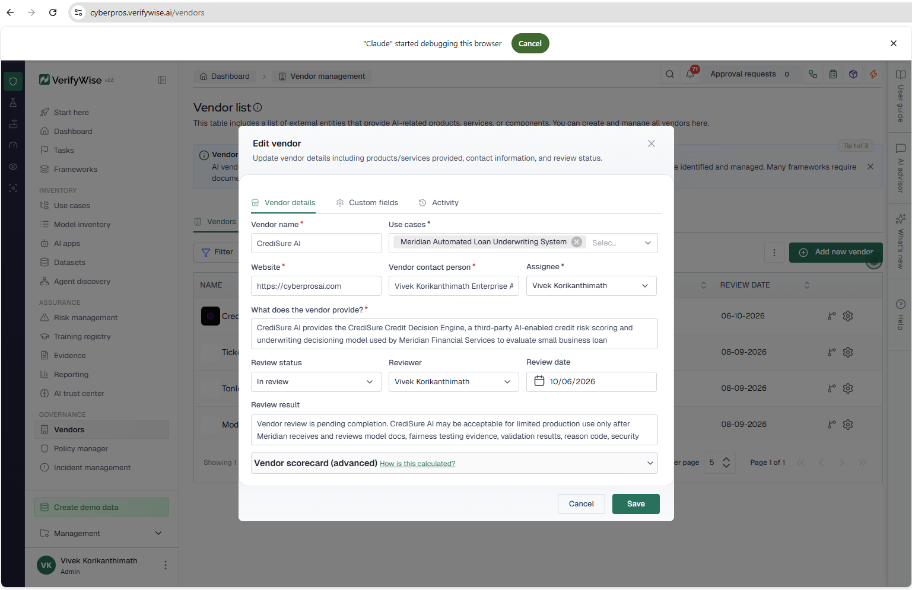

> **Caption:** This screenshot shows the CrediSure AI vendor record documenting the third-party provider responsible for the credit decisioning model.

**Skill demonstrated:** Third-party AI vendor risk management and vendor governance documentation.

---

### 6. Framework Assessments

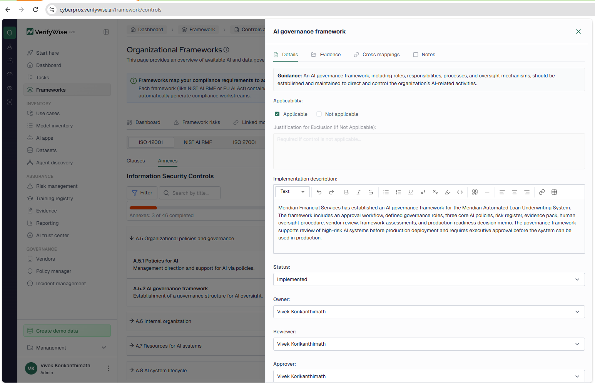
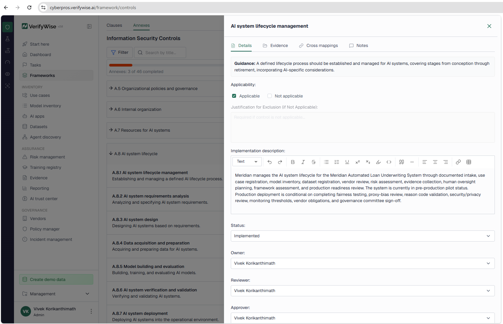
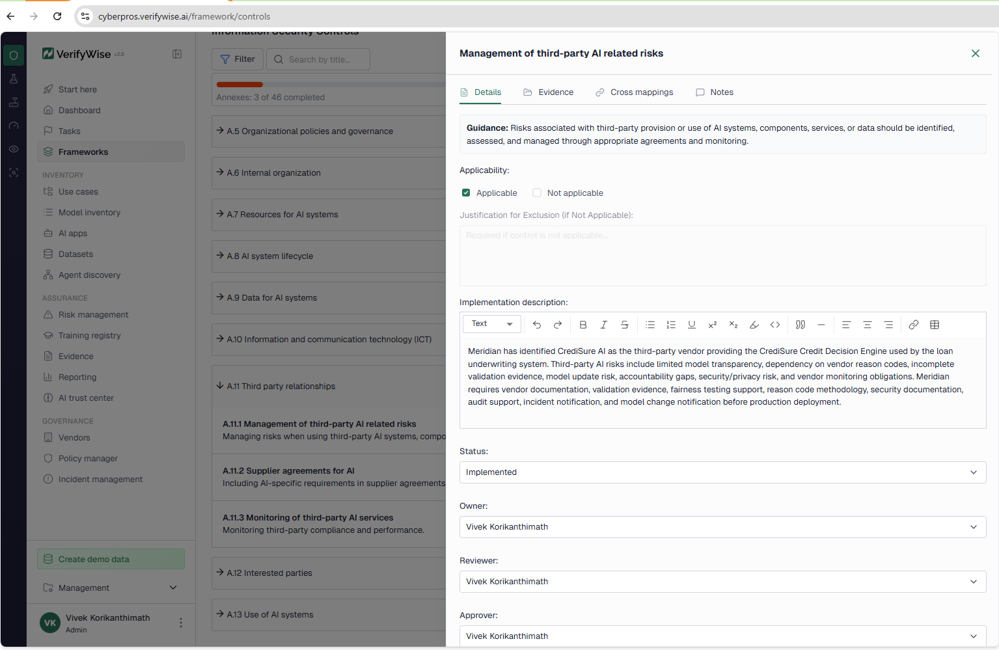

> **Caption:** This screenshot shows selected framework assessment progress for NIST AI RMF, ISO/IEC 42001, and EU AI Act governance requirements.

**Skill demonstrated:** Practical framework application and evidence-based AI governance assessment.

---

### 7. Fundamental Rights Impact Assessment (FRIA) Summary

> **Caption:** This screenshot shows the EU AI Act Fundamental Rights Impact Assessment summary for the Meridian Automated Loan Underwriting System.

**Skill demonstrated:** Fundamental rights risk assessment, high-risk AI review, human oversight analysis, and conditional deployment recommendation.

---

### 8. Final Report

[Vivek_Korikanthimath_AI_Governance_Portfolio_Report.pdf](Vivek_Korikanthimath_AI_Governance_Portfolio_Report.pdf)

**Skill demonstrated:** Governance evidence organization and final reporting.

## Final Recommendation

My final recommendation is:

> **Proceed with conditions.**

Meridian should not approve unrestricted production deployment at this time.

The system may move forward only if the following conditions are completed:

- Complete fairness testing and disparate impact analysis
- Complete proxy-bias review
- Validate denial reason codes
- Define mandatory human review triggers
- Establish appeal and reconsideration procedures
- Complete vendor documentation review
- Complete security and privacy review
- Define model and outcome monitoring thresholds
- Implement decision-level audit logging
- Establish incident escalation procedures
- Obtain governance committee approval

---

## Portfolio Conclusion

This project demonstrates my ability to evaluate a high-risk AI system from an AI governance, risk, and compliance perspective.

The Meridian Automated Loan Underwriting System offers business benefits, including faster decisions, improved consistency, and operational efficiency. However, because it affects access to credit and automates most decisions, it requires strong governance before deployment.

As AI Governance Lead, my assessment found that the system should not receive unrestricted production approval until Meridian completes required fairness, explainability, human oversight, vendor, monitoring, privacy, and governance controls.

This project reflects how I would support responsible AI deployment in a real organization.

---

## Disclaimer

This is a fictional educational portfolio project created for AI governance, risk, and compliance training. It does not represent legal advice, regulatory certification, credit decisioning advice, or an actual assessment of a real financial institution.

---

## Additional Screenshots

### Training Registry

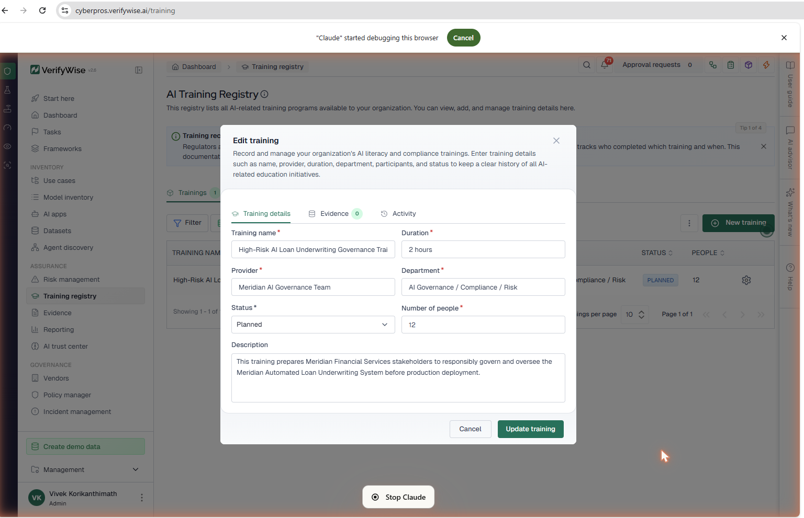

> **Caption:** This screenshot shows the AI training registry record for the Meridian Automated Loan Underwriting System, documenting planned governance training for stakeholders responsible for compliance, model risk, credit risk, human oversight, vendor risk, and executive approval.

### Policies

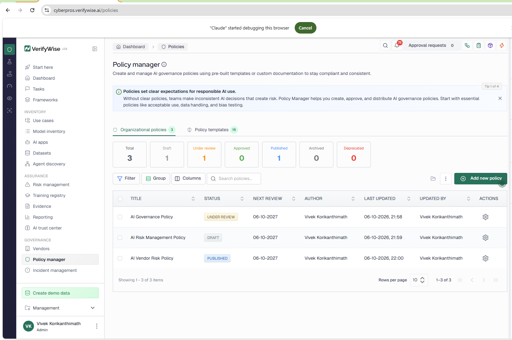

> **Caption:** This screenshot shows the three core organizational AI policies selected for the Meridian Automated Loan Underwriting System: AI Governance Policy, AI Risk Management Policy, and AI Vendor Risk Policy. These policies establish the minimum governance, risk management, and third-party oversight structure for the high-risk AI portfolio.

### NIST AI RMF

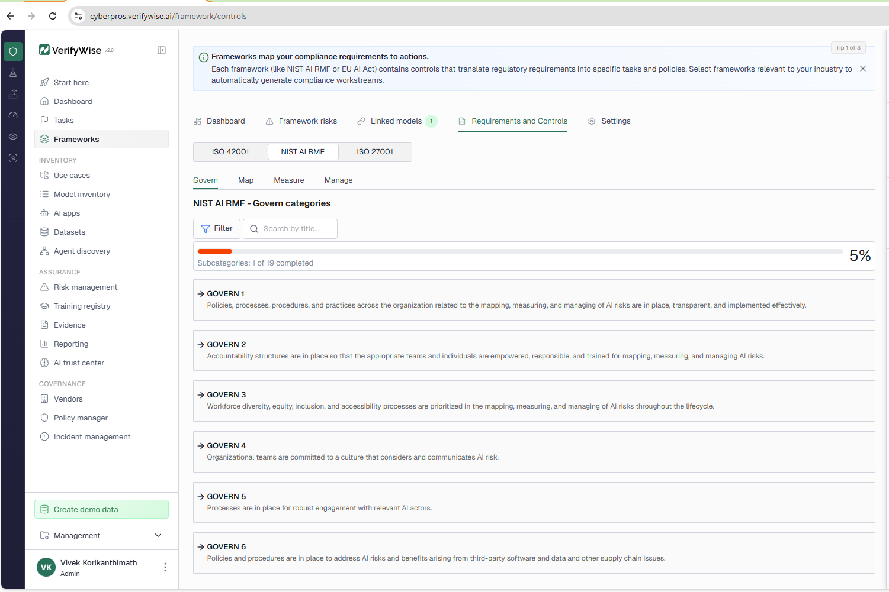

> **Caption:** This screenshot shows the four must-have NIST AI RMF subfunctions completed for the Meridian Automated Loan Underwriting System, covering human-AI oversight roles, system context, evaluation evidence, and prioritized AI risk treatment.

---

## Notes on platform limitations

The project was completed in VerifyWise as instructed. Where the platform differed from the instructions, the closest available option was used:

- **Model capabilities:** "Scoring" and "Risk assessment" are not available; Recommendation, Summarization, Anomaly Detection and Forecasting (closest to Prediction) were selected. A unique external key was required for the model.
- **Risk categories:** no "Ethical risk" or "Model risk" option (Technological used); "Data risk" mapped to "Data privacy risk"; "Governance risk" mapped to "Strategic risk". "Awaiting Review" is not an approval status, so "Requires review" was used. The Recommendations field did not save on any risk.
- **NIST AI RMF:** "Completed" is not a status option, so MEASURE and MANAGE use "Implemented". VerifyWise list numbering differs from the subcategory titles (e.g., the GOVERN 3.3.2 item appears as GOVERN 3.2).
- **ISO/IEC 42001:** A.8 and A.11 are section headers, so the implementation text was placed on A.8.1 and A.11.1.
- **EU AI Act:** owner, reviewer, approver, risk review and due date exist only at control level, not per subcontrol. Attaching existing evidence files to requirement subcontrols reported success but did not persist, so evidence was uploaded directly to each subcontrol instead. FRIA evidence attachments display without file names (a display issue).
- **FRIA:** "Private entity" is not a High-Risk Basis option, so "Annex III use case" was selected. First Use Date is left blank (production date unknown), which keeps completion at 95%.
- **Vendor:** the contact field rejects commas. The vendor website was given as two slightly different URLs in the instructions; cyberprosai.com was used consistently.
- **Report:** the generated use case report does not include the incident record (INC-15), although it exists in VerifyWise.
